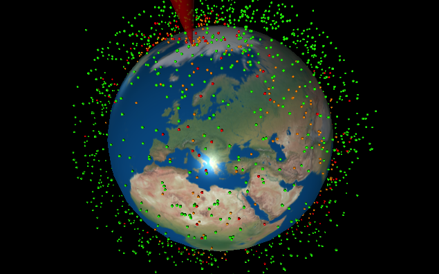
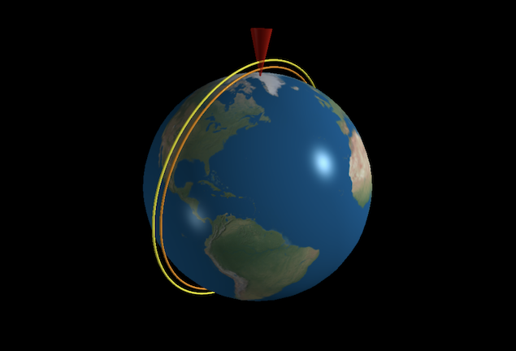
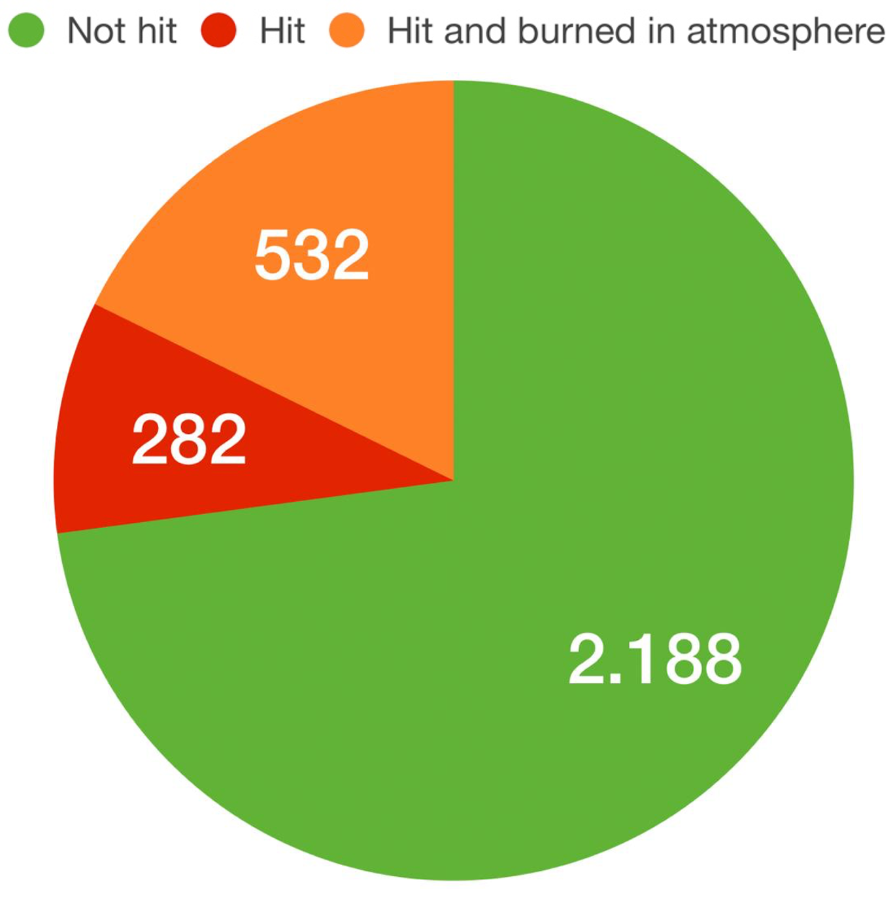

# Removing space debris with a propulsion laser

In this repository, a simulation and visualization of a propulsion laser that removes space debris from the low Earth orbit is made. Below you can see the instructions on how to run the simulations and visualizations. 

## Results
Simulating and visualizing 3000+ satellites
  
Simulating and visualizing one satellite
  
Simulation results

## Instructions

### Clone repository
`$ git clone https://github.com/KalleJanssen/group10_PCS.git`

### Install all dependencies
`$ pip3 install -r requirements.txt`

### How to run simulation and visualization

#### Simulation only for 3000+ satellites (gives results in print)
`$ python3 sim_only_multi.py`

#### Simulation + visualization for 3000+ satellites (shows visualization of above)
`$ python3 sim_vis_multi.py`

#### Simulation + visualization for one satellite (visualizes old and new orbit after hit)
`$ python3 sim_vis_solo.py`

#### Calculation of the best location for the laser
`$ python3 calc_laser_pos.py`

## Old stuff
In the folder old_stuff is unused code that we still wanted to keep, most of this code is not commented.
